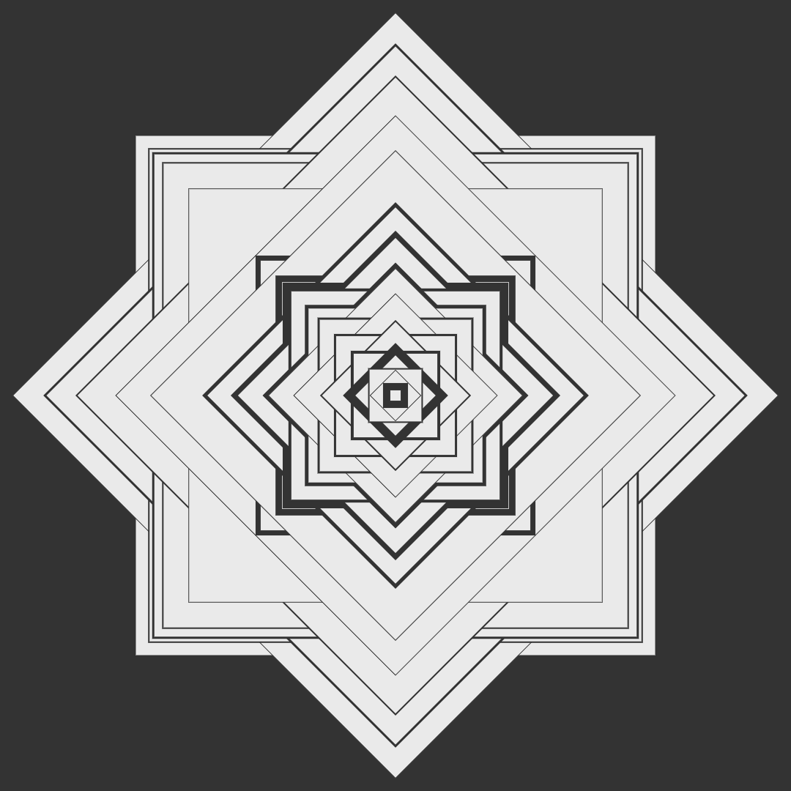

# Dynamic Geometry
## Final Canvas Sketch Project "Creative Coding: Making Visuals with JavaScript"

## Overview

This project utilizes the `canvas-sketch` library to generate visually dynamic square patterns on an HTML canvas. The squares feature randomized line widths and positions, resulting in an artistic and ever-changing composition.

## Customization

- Adjust the `limit` variable in the code to control the number of squares.
- Modify the `bgColor`, `lineColor`, and other color variables for a different visual style.
- Customize author and date information directly in the code.

## Author

- Verónica García Gayol
- January 5, 2024
  
## Some examples

  
  
  
  

  
  
  
  

  
  
  
  

  
  
  
  

  
  
  
  

  
  
  
  

